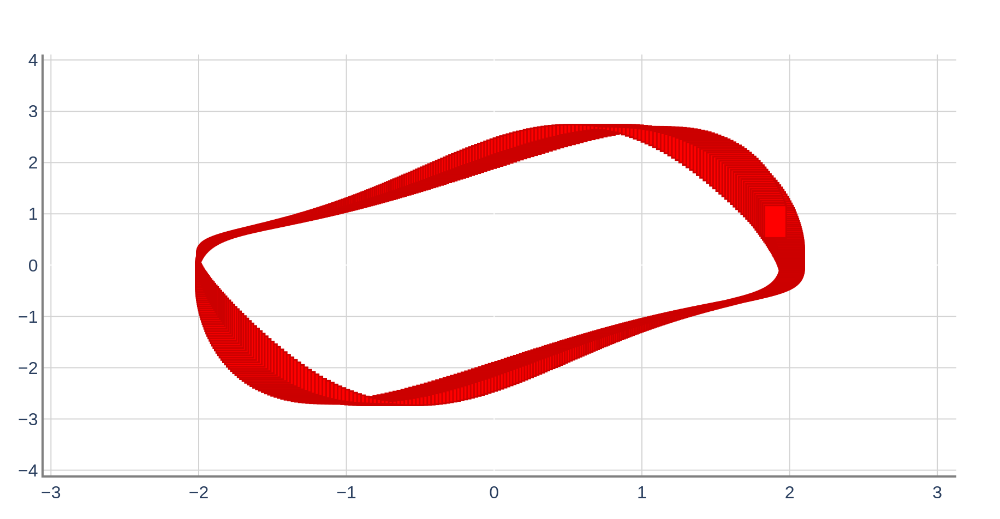
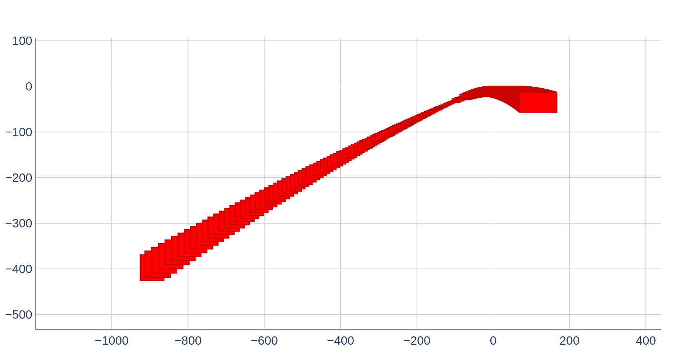
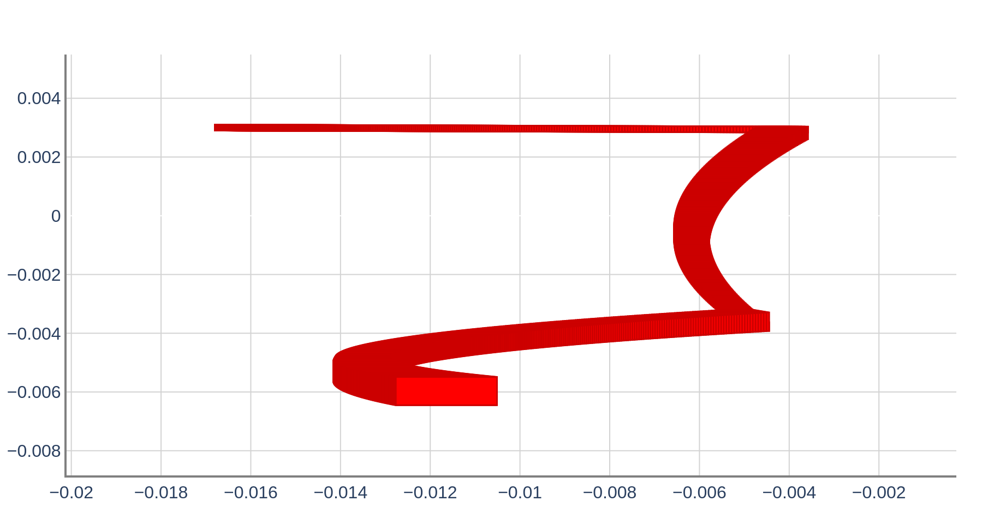

# Overview 

This is the repeatability evaluation package for the tool paper entitled "Verse: A Python library for reasoning about multi-agent hybrid system scenarios", by Yangge Li, Haoqing Zhu, Katherine Braught, Keyi Shen, Sayan Mitra, which is going to appear in the proceedings of the 35th International Conference on Computer Aided Verification, 2023.

The artifact is a virtual machine that contains instruction and software to reproduce all experiment results in the paper.

Password forartifact VM:<code>cav2023-re</code>
DOI: 10.6084/m9.figshare.22679485

Instructions for reproducing experiments in the paper:
<code>artifact_evaluation.txt</code>
<code>artifact_evaluation.md</code>
<code>artifact_evaluation.pdf</code>

Alternative urls for download: 
https://figshare.com/articles/software/Verse_A_Python_library_for_reasoning_about_multi-agent_hybrid_system_scenarios/22679485
https://drive.google.com/file/d/1SfABQ1bkFXijCpANfODQAMdvFnBXpw0a/view?usp=sharing

Interactive tutorial (Jupytr notebook): https://github.com/AutoVerse-ai/Verse-library/blob/main/tutorial/tutorial.ipynb
Tutorial (pdf):https://github.com/AutoVerse-ai/Verse-library/blob/main/tutorial/tutorial.pdf

Public url:https://github.com/AutoVerse-ai/Verse-library

# Approximate Running Time for Experiments

Regenerating the data in Table 1 of the paper takes about 1187.6 seconds (~20 mins).

Regenerating Table 2 (Simulation part) takes about 174 seconds (~3 mins).

Regenerating Table 2 (Reachability part) takes about 1573 seconds (~26 mins).

# Instructions for Replication Test

0. Move to the root directory of the tool:
```
    cd /home/cav23/Desktop/Verse-library
```
1. For results in Table 1 run 
```
    python3 artifact_evaluation/exprs.py 
```
    The results for all experiments in Table 1 will be generated as below. 
    ```
        2 & Q & M6 & DryVR & No & 8 & 34.54\\
        2 & Q & M5 & DryVR & No & 5 & 31.67\\
        2 & Q & M5 & NeuReach & No & 4 & 261.41\\
        3 & Q & M5 & DryVR & No & 7 & 42.67\\
        7 & C & M2 & DryVR & No & 37 & 59.95\\
        3 & C & M1 & DryVR & No & 5 & 26.36\\
        3 & C & M3 & DryVR & No & 4 & 34.23\\
        3 & C & M4 & DryVR & No & 7 & 74.02\\
        3 & C & M1 & DryVR & Yes & 5 & 26.85\\
        2 & C & M1 & DryVR & No & 5 & 23.0\\
        2 & C & M1 & NeuReach & No & 5 & 319.34\\
        1 & V & N/A & DryVR & N/A & 1 & 13.85\\
        1 & S & N/A & DryVR & N/A & 3 & 14.7\\
        1 & G & N/A & DryVR & N/A & 3 & 22.99\\
    ```
Each row corresponds to entry in the table from left to right, top to bottom. 

2. For results in Table 2,
   
    <strong>Simulation</strong>: Run command 
    ```
        python3 artifact_evaluation/inc-expr.py s
    ```

    The results for the experiments in Table 2 section Simulation will be generated as below at the end of execution

    ```
        & repeat & 45 & 16.92 & 430 & 1.05 & 438 & 3.83 & 83.33 \\
        & change init & 24 & 14.93 & 431 & 12.98 & 436 & 4.07 & 75.91 \\
        & change ctlr & 45 & 16.1 & 431 & 8.49 & 438 & 4.38 & 78.19 \\
    ```

    <strong>Reach</strong>: Run command 
    ```
        python3 artifact_evaluation/inc-expr.py v  
    ```
    The results for the experiments in Table 2 section Verification will be generated as below at the end of execution
    ```
        & repeat & 105 & 464.77 & 498 & 58.99 & 482 & 3.23 & 76.79 \\
        & change init & 49 & 384.84 & 486 & 362.25 & 500 & 3.7 & 73.21 \\
        & change ctlr & 93 & 428.83 & 498 & 227.49 & 491 & 4.0 & 73.44 \\
    ```

3. To reproduce Fig. 1,
    
    <strong>Center</strong>: Run command 
    ```
        python3 demo/cav2023/exp1/exp1_sim.py p 
    ```
    Verse will automatically open a browser window to show the resulting plot as below.

    


    <strong>Right</strong>: Run command 
    ```
        python3 demo/cav2023/exp1/exp1.py p
    ```
    

4. To reproduce Fig. 4, from left to right 
   
    <strong>(1)</strong> Run command 
    ```
        python3 demo/cav2023/exp9/exp9_dryvr.py pl
    ```
    The result will looks like below.
    

    <strong>(2)-(3)</strong> Run command 
    ```
        python3 demo/cav2023/exp9/exp9_dryvr.py pc
    ```
    Verse will automatically open two browser windows to show the two resulting plots as below. Note that the yellow boxes in the figures are drawn separately. 
    

    

    <strong>(4)</strong> Run command 
    ```
        python3 demo/cav2023/exp10/exp10_dryvr.py p 
    ```
    The result will looks like below.
    
    
5. To reproduce Fig. 6, 

    <strong>Left</strong>: Run command 
    ```
        python3 demo/cav2023/exp2/exp2_straight.py p 
    ```
    Verse will automatically open a browser window to show the resulting plot as below. 
    

    <strong>Center</strong>: Run command 
    ```
        python3 demo/cav2023/exp2/exp2_curve.py p 
    ```
    Verse will automatically open a browser window to show the resulting plot as below. 
    
    
    <strong>Right</strong>: Run command 
    ```
        python3 demo/cav2023/exp4/exp4.py p
    ```
    Verse will automatically open a browser window to show the resulting plot as below. 
    

6. To reproduce Fig. 8 in Appendix, run command  
    ```
        python3 demo/cav2023/exp7/exp7.py p
    ```
    Verse will automatically open two browser windows to show the plots as shown below.
        

       

7. To reproduce Fig. 7 in Appendix, run command 
    ```
        python3 demo/cav2023/exp5/exp5.py p
    ```
    Verse will automatically open a browser window to show the resulting plot. The right figure is a zoom in of the left figure as shown below. 
    

8. To reproduce Fig. 10 in Appendix, 
    
    <strong>Left</strong>: Run command  
    ```
        python3 demo/cav2023/exp6/exp6_neureach.py p
    ```
    Verse will automatically open a browser window to show the resulting plot as shown below. Note that due to the randomization in NeuReach's algorithm, the generated figure can be slightly different from the one included in the paper.
        

    <strong>Right</strong>: Run command 
    ```
        python3 demo/cav2023/exp6/exp6_dryvr.py p 
    ```
    Verse will automatically open a browser window to show the resulting plot as shown below. 
        

9. To reproduce Fig. 11 in Appendix, run command 
    ```
        python3 demo/cav2023/exp3/exp3.py p
    ```
    Verse will automatically open a browser window to show the resulting plot as shown below. 
        

10. To reproduce Fig. 12 in Appendix, run command 
    <strong>Left</strong>: Run command 
    ```
        pyhton3 demo/cav2023/exp12/vanderpol_demo2.py p 
    ```
    Verse will automatically open a browser window to show the resulting plot as shown below
    

    <strong>Center</strong>: Run command 
    ```
        pyhton3 demo/cav2023/exp12/vanderpol_demo2.py p 
    ```
    Verse will automatically open a browser window to show the resulting plot as shown below
    

    <strong>Right</strong>: Run command 
    ```
        pyhton3 demo/cav2023/exp12/vanderpol_demo2.py p 
    ```
    Verse will automatically open a browser window to show the resulting plot as shown below
    


11. To reproduce Fig. 13 in Appendix 
    <strong>Left</strong>: Run command 
    ```
        python3 demo/cav2023/exp11/inc-expr.py sbp
    ```
    Verse will automatically open a browser window to show the resulting plot as shown below 
        

    <strong>Right</strong>: Run command 
    ```
        python3 demo/cav2023/exp11/inc-expr.py vbp
    ```
    Verse will automatically open a browser window to show the resulting plot as below. 
        

12. To reproduce Fig. 16 in Appendix 
    <strong>Left</strong>: Run command 
    ```
        python3 demo/cav2023/exp11/inc-expr.py snp
    ```
    Verse will automatically open a browser window to show the resulting plot as below. Note that the red box in the figure is added seperately.
        

    <strong>Right</strong>: Run command 
    ```
        python3 demo/cav2023/exp11/inc-expr.py vnp
    ```
    Verse will automatically open a browser window to show the resulting plot as below. Note that the red box in the figure is added seperately.
        

13. To reproduce Fig. 17 in Appendix 
    <strong>Left</strong>: Run command 
    ```
        python3 demo/cav2023/exp11/inc-expr.py s8p
    ```
    Verse will automatically open a browser window to show the resulting plot as below. Note that the red box in the figure is added seperately.
        

    <strong>Right</strong>: Run command 
    ```
        python3 demo/cav2023/exp11/inc-expr.py v8p
    ```
    Verse will automatically open a browser window to show the resulting plot as below. Note that the red box in the figure is added seperately.
        
