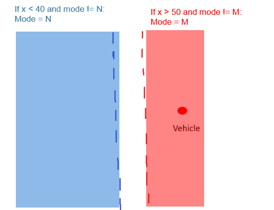
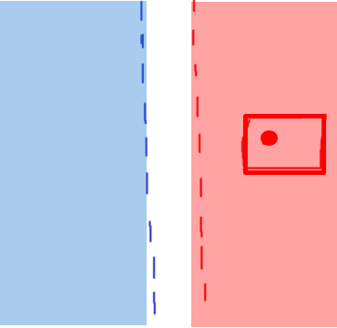
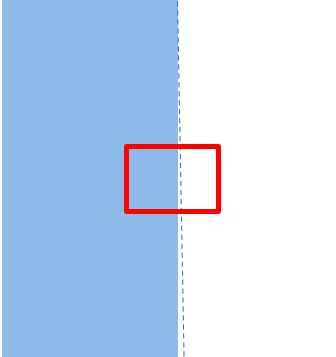
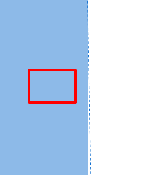
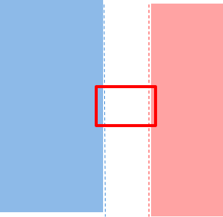
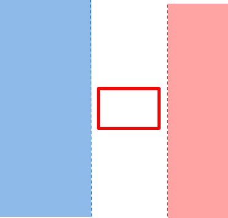
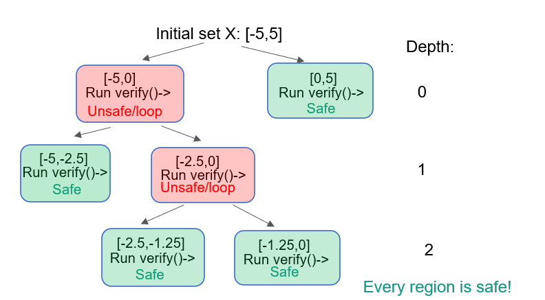

# Troubleshooting Verse

This is a guide to troubleshooting the most common issues in using Verse.


## Unsuported Operations

Even though the decision logic for mode transitions is written in Python, it is not run in the traditional sense. Verse takes the decision logic and parses it for analysis.

Verse's parser only supports the following:
- if statements
- arithmetic operators (+,-,/,*)
- logical operators (and, or , not)
- comparison operators (<=, <, ==, ! =, >, >=)
- functions
- assertions (for defining safety)
- "any" function
- "all" function


This means that the following are *not* supported in reachability (don't even try it):
- print statements
- numpy functions
- variables defined behind an if statement
- loops (except any and all statements)


It is also highly recommended not to use else/elif statements.

If something is not supported, the parser will usually throw a "Not Supported" error message.

Since simulate_simple bypasses the parser, it may be able to handle code unsuported by the parser. 

In terms of formatting, you may nest if statements as follows:

```python

if ego.craft_mode == CraftMode.Normal:
    if .... :
        next.craft_mode == ....
    if ....:
        next.craft_mode ==....


```
## Interpreting the Console Output 

Verse builds a tree where each node stores the trace/reachable set after each mode transition.

Whenever a transition has occured, a console message will appear.


The node number is the id of the node in order of when it was first added to the processing queue.

The "Time:" indicates the time that this transition occured. If this number is not changing, then an infinite loop has occured. 

On the next line, it will display each agent and the mode of that agent after the transition. If an infinite loop occurs, you can look at this line to see which modes are being looped through.

If there is another mode transition at this point, it will print the condition of the DL that triggered this transition.
## Resolving Infinite Loops

Take this decision logic snippet:

```python

if ego.craft_mode == CraftMode.Normal:
    next.craft_mode == CraftMode.Up

if ego.craft_mode == CraftMode.Normal:
    next.craft_mode == CraftMode.Down

```
We can see that the transition condition is the exact same in both if statements. In this case, both the "up" and "down" branches will both be ran by Verse. This is how Verse handles non-determinism and this will not cause an infinite loop 

<br/><br/>
Now take, for example, this logic:

```python

if ego.craft_mode == CraftMode.Normal:
    next.craft_mode == CraftMode.Up

if ego.craft_mode == CraftMode.Up:
    next.craft_mode == CraftMode.Normal

```

In Verse, a transition can happen IMMEDIATELY before time continues 

In this example, we can clearly see a cycle. When the craft mode is "Normal", it will  transition to "Up" due to the 1st if statement. Then it will IMMEDIATELY transition back to Normal due to the 2nd condition being true.
Avoid situations where a transition can happen immediately after another.

<br/><br/>


Another example:
```python

if ego.z <= 50:
    next.craft_mode == CraftMode.Up

```

In this case, this if statement will be evaluated but before time can coninue, the same transition will IMMEDIATELY happen again. 
This is because ego.z has not changed since time has not continued forward. 

Make the transition condition more specific to include the mode in the if statement:

```python

if ego.craft_mode == CraftMode.Normal and ego.z <= 50:
    next.craft_mode == CraftMode.Up

```

if you are still having an infinite loop consider this example:


```python

if ego.x < 40 and ego.mode != N:
    next.mode = N

if ego.x > 50 and ego.mode != M:
    next.mode = M

```



Vehicle state is single point with negative velocity and mode M. This means it is moving to the left.
The colored regions (loosely) represent the guard/transition region where a transition can happen




Verify function over-approximates state as a rectangle (slice of reachable set )


When Entering guard region, Rectangle will first PARTIALLY intersect guard until it is FULLY contained in guard region.  

Partially intersecting:


Full Containment


When the rectangle is PARTIALLY intersecting two or more guard regions, this will cause an infinite loop as Verse will again try to repeatedly analyze all possible transitions



Solution:

Make guard region boundaries further apart



```python

if ego.x < 30 and ego.mode != N:
    next.mode = N

if ego.x > 50 and ego.mode != M:
    next.mode = M

```
If you are doing 484 MP0, you may also use the verify_refine() function which will repeatedly partition the initial set into smaller and smaller chunks until all of the initial set is safe. 



When the initial set is smaller, verse's over-aproximation tends to be smaller as well. 


## Other Issues

### The lower bounds in the initial conditions should always be lower than the upper bounds.


```python

scenario.set_init(
        [
            [[10, 20, 15], [15, 15, 20]],
        ],
       ...
    )
```

We can see that in the second state variable, the lower bound (20) is higher than the upper bound (15). 


### In the decision logic, always modify a copy of "ego" and not "ego" itself. 

There should be a

```python

next =  copy.deepcopy(ego)
```
at the beginning of each decision logic. "next" should be modified instead of "ego".

You also may not modify "others"

### Each agent id must be unique.

If "car_1" is already defined,
```python

car1 = new_agent("car_1", file_name=input_code_name)
```

Do not define it again

```python

car2 = new_agent("car_1", file_name=input_code_name)
```


